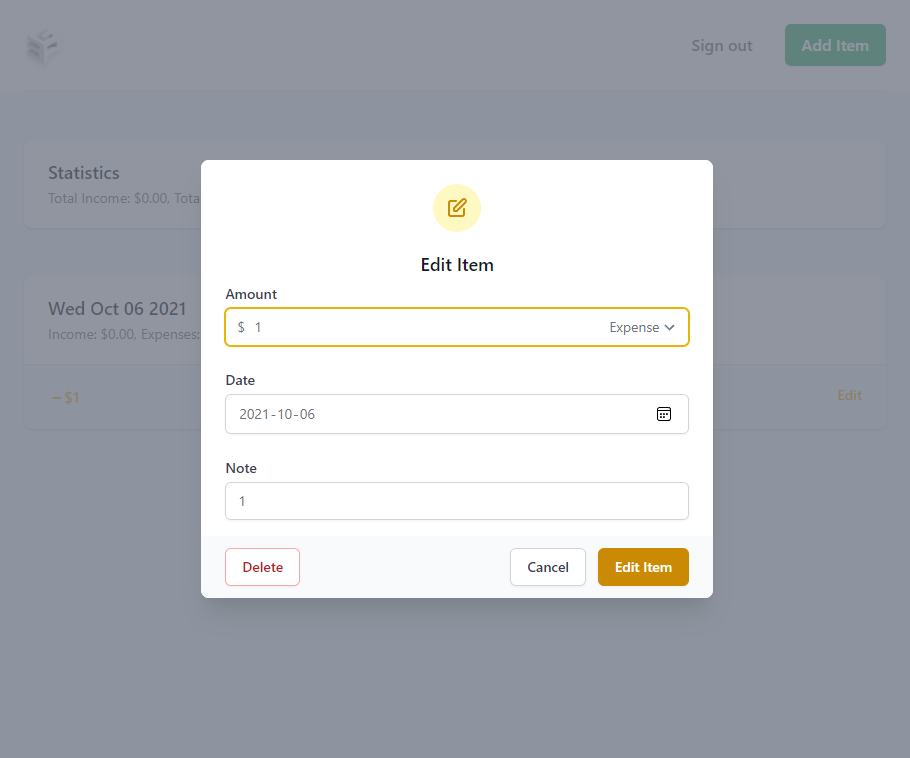
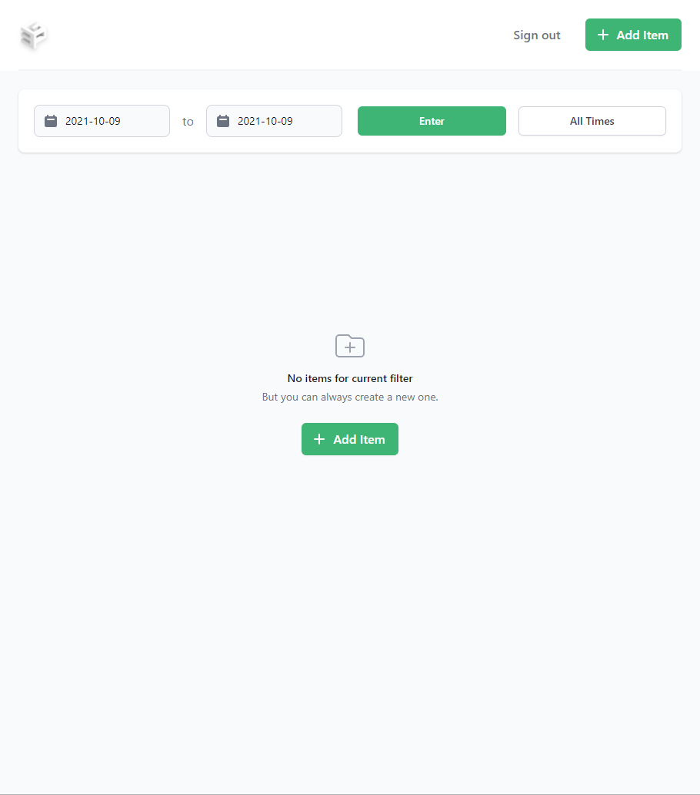

# G3P Expense Tracker

### Yihong Xu

[https://a5-gp2p.glitch.me/](https://a5-gp2p.glitch.me/)

This is an iterated version of my A3 project which is an online expense tracker for users that want the least disturbing and more peace of mind.

## Features:

1. **View by Selection:** View transactions according to date range selection
2. **View all times:** View transaction of all times
3. **Statistics of selection:** Top of page shows statistics of current filter
4. **Main Page Content Update:** No need to reload the page to get new data anymore
5. **Faster:** Optimized overall response times in various ways, including a complete overhaul to data structure.
6. **UI/UX Improvements**

## Develop Notes:

#### Data structure, where computation happens, and what gets sent

I am using an embedded document pattern, which is not an efficient way to store in mongoDB when the data set grows large per user (document). Ideally, I should have a collection for a user instead of a collection for an app.

Now I wanted to optimize load time by reducing the network usage between mongoDB and the Node.js server since it's sending all of a user's document's data to the server (for example, only transmit data that are relevant when only showing transactions happened in a timeframe, or searching for a specific transaction), but mongoDB seems to always return the entire document instead of only the sub-documents that satisfies the filter.

I could restructure the project and have each transaction be a document and every user's documents are still stored in the app's collection, but that way querying for all of a user's document requires going through the entire database. Since there is only one level of efficient document management (the document level, under the collection level, above the sub-document level, is what can be returned atomically), I decide that computation for filtering either happen on the Node.js server side or the client side.

I could restructure the project and have each transaction be a document each user will be one collection, but that might disable the app from being accessed by different users at the same time. I did not investigate that very much.

Since novel client devices are very powerful for that level of computation but sending all the files down the pipe just to be sorted/filtered on the client side may lag up the loading. There don't seem to be one single conclusion, but I decided that I will make filtering computations happen on server side to reduce network usages between server and client, and sorting computations on client side to save server computation.

Update: I have looked more into the feasibility of having each user occupy a collection. Since someone compares mongoDB collections as SQL tables, I am going to implement that instead. I will have a collection that is always connected as the table to store users and their information, and create a collection when a user is created.

Update: I finished refactoring the server code from one collection for all users to one user per collection. Got rid of a lot of chunky code resulted from embedded array of objects. It's much fresher to be able to use the driver's native functions instead of using `updateOne()` for everything.

Update: Feels like this change is well worth it, just like some other decisions previously. It has already made it much easier to do things (and more secure since some data isn't passed around), not to say it will sort and filter the data for me in the future.

#### UI/UX Stuff

I noticed a set of arrows on the number input field that overlaid with my nice looking inline expense/income selector. Realized they are spinners and finally eliminated them by changing the pre-compile tailwind CSS file. I also restructured the add/edit popup, so they look more natural and balanced. I also looked up how to get the delete button to be on the left instead of right with cancel/edit, and it turns out nice. I also fixed an issue where the popup is positioned near the end of the screen on mobile devices.

Before:

After:

#### Main page content refresh

I want the page's content to be changeable without reloading, so I can implement view by timeframe, sort by amount, and the #tag system. To do this, I make the js clear all the page's data on next load and refills it with new data retrieved from the server. When loading, the date picker stays so when an empty selection was made and the screen shows an empty indicator, the user can still switch to use another filter.

##### Date Range Picker

I was trying to find a good time range picker for the page and finally came upon `tailwind-datepicker` (which I later realize is a fork of another package called `vanillajs-datepicker`). But it turns out not working, and I had to solve many issues. It was asking for type module which disallows other Node.js dependencies to work. The import string from its website is actually incorrect or unusable (missing /js/ folder before js file, and missing .js extension of file). After I corrected the string I had to make the server serve the files for the client site to use this node package, good thing it does not use more dependencies. After that it still shows randomly, and I realized my purgeCSS did not add the parts in node_modules to the whitelist, it took me some more time to figure out a simple fix. Then I went to the initial project's demo site and configured the options I wanted, I have to say it is very customizable and looks really mature.

##### New Statistics Bar

The stats bar needs to change to work with the date range picker, and it has to be more beautiful and useful

##### Loading... Wow, such empty

The loading indicator used to be from the html itself (and gets removed once the js loads data in) and the empty indicator is inserted by the js. Since I'm making the page updatable without reloading, the loading indicator needs to be injected by the js before it tries to connect to the server, and the empty indicator needs to be changed to be located correctly.

Before:

After:

